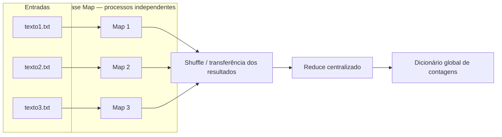

# Laboratório 2 — Processamento Distribuído com MapReduce

Este projeto implementa uma contagem de palavras sobre múltiplos ficheiros de
texto e compara duas estratégias de execução do mesmo algoritmo:

1. **Sequencial:** os ficheiros são processados um após o outro pelo processo
   principal.
2. **Distribuída/multiprocesso:** os ficheiros são atribuídos a processos
   independentes, que executam a fase Map em paralelo e devolvem resultados
   parciais ao processo principal para a fase Reduce.

O objetivo é demonstrar os princípios do modelo MapReduce, medir o custo do
paralelismo e calcular o ganho de desempenho relativamente à execução
sequencial. A implementação utiliza exclusivamente a biblioteca padrão do
Python, principalmente `multiprocessing`, `collections` e `time`.

> Neste laboratório, processos locais simulam nós de uma arquitetura
> distribuída. Cada processo possui espaço de memória próprio e os dados são
> transferidos através dos mecanismos de serialização e comunicação do
> `multiprocessing`.

## O que o programa faz

Para cada execução, o programa:

1. valida a existência dos ficheiros de entrada;
2. percorre cada ficheiro linha a linha;
3. separa, normaliza e conta as palavras localmente;
4. agrega os dicionários de contagens numa contagem global;
5. executa o algoritmo primeiro de forma sequencial e depois em paralelo;
6. confirma que ambos os modos produziram exatamente o mesmo resultado;
7. mede os tempos com um relógio monotónico de alta resolução;
8. calcula o speedup `S = T_sequencial / T_distribuído`;
9. apresenta as palavras mais frequentes e, opcionalmente, exporta todas as
   métricas e contagens para JSON.

## Arquitetura



Cada tarefa Map devolve um dicionário no formato `palavra -> quantidade`. O
`Pool` transmite esses dicionários ao processo principal; essa transferência
representa a fase de comunicação/shuffle desta implementação. O Reduce soma os
valores associados à mesma palavra através de um `Counter`.

## Como foi implementado

### Fase Map

A função `map_function()` recebe o caminho de um ficheiro. O ficheiro é aberto
em UTF-8 e consumido incrementalmente, linha a linha, evitando que todo o seu
conteúdo seja mantido em memória. Para cada token:

- `casefold()` efetua uma normalização de maiúsculas/minúsculas adequada a texto
  Unicode;
- `str.isalnum()` remove pontuação e conserva letras e números;
- um `collections.Counter` mantém a contagem local.

Esta normalização segue a regra do código-base do enunciado. Como consequência,
pontuação no interior de um token é removida: por exemplo, `Map-Reduce` torna-se
`mapreduce`.

### Fase Shuffle e Reduce

No modo distribuído, `multiprocessing.Pool.map()` atribui um ficheiro a cada
tarefa Map. Os resultados são serializados pelo Python e enviados ao processo
principal. A função `reduce_function()` recebe os dicionários intermédios e soma
as contagens com `Counter.update()`.

O `Pool` é usado como context manager, garantindo o encerramento e a espera por
todos os processos mesmo se ocorrer uma exceção. O bloco
`if __name__ == "__main__"` e `multiprocessing.freeze_support()` tornam a
execução segura em Windows, onde os processos usam normalmente o método
`spawn`.

### Medição e validação

Os tempos são medidos com `time.perf_counter()`, apropriado para intervalos
curtos por ser monotónico e possuir alta resolução. Quando há várias repetições,
o programa reporta a **mediana**, que é menos sensível a interferências pontuais
do sistema do que a média.

Após cada repetição, os dicionários produzidos pelos modos sequencial e
distribuído são comparados. Uma diferença interrompe o programa com erro de
consistência, impedindo que um tempo aparentemente melhor esconda um resultado
incorreto.

O número efetivo de workers nunca ultrapassa o número de ficheiros, porque esta
implementação cria uma tarefa Map por ficheiro. Criar processos adicionais não
forneceria trabalho extra e aumentaria o overhead.

## Estrutura do projeto

```text
lab2_sdp/
├── lab_distribuido.py       # Algoritmo MapReduce, benchmark e interface CLI
├── gerar_dados.py           # Gerador determinístico dos dados de teste
├── texto1.txt               # Entrada de aproximadamente 8 MiB
├── texto2.txt               # Entrada de aproximadamente 8 MiB
├── texto3.txt               # Entrada de aproximadamente 8 MiB
├── resultado.json           # Métricas e contagens da execução realizada
├── tests/
│   └── test_lab_distribuido.py
├── RELATORIO.md             # Relatório académico e análise do experimento
└── README.md
```

## Requisitos

- Python 3.10 ou superior;
- aproximadamente 30 MiB livres para os dados e resultados;
- pelo menos dois núcleos lógicos para observar paralelismo real.

Não é necessário instalar pacotes externos nem executar `pip install`.

Verifique a versão instalada:

```powershell
python --version
```

## Como executar

Execute os comandos seguintes a partir da raiz do projeto.

### 1. Gerar ou regenerar os ficheiros de entrada

Os três ficheiros de 8 MiB já fazem parte do projeto. Para os recriar:

```powershell
python gerar_dados.py
```

Para escolher outro tamanho por ficheiro ou outro diretório:

```powershell
python gerar_dados.py --tamanho-mb 32 --destino .\dados
```

O conteúdo é determinístico: o mesmo comando gera novamente os mesmos blocos de
texto, o que facilita a reprodução e comparação dos resultados.

### 2. Executar com a configuração padrão

```powershell
python lab_distribuido.py
```

Sem argumentos, são utilizados `texto1.txt`, `texto2.txt` e `texto3.txt`, com um
processo Map por ficheiro e uma repetição.

### 3. Executar um benchmark mais estável

```powershell
python lab_distribuido.py --repeticoes 5 --json resultado.json
```

Esse comando executa cada estratégia cinco vezes, apresenta a mediana e grava as
métricas e a contagem integral em `resultado.json`.

### 4. Usar ficheiros ou parâmetros personalizados

```powershell
python lab_distribuido.py .\dados\a.txt .\dados\b.txt -p 2 -r 3 --top 15
```

Os ficheiros devem estar codificados em UTF-8. A ordem dos argumentos
posicionais não altera a contagem final.

## Parâmetros da linha de comandos

| Parâmetro | Descrição | Valor padrão |
|---|---|---|
| `ficheiros` | Lista de ficheiros UTF-8 a processar | `texto1.txt texto2.txt texto3.txt` |
| `-p`, `--processos` | Número máximo de processos Map | Um por ficheiro |
| `-r`, `--repeticoes` | Número de execuções; reporta-se a mediana | `1` |
| `--top` | Número de palavras mais frequentes a apresentar | `10` |
| `--json FICHEIRO` | Caminho para exportar métricas e contagens | Não exporta |
| `-h`, `--help` | Mostra a ajuda da aplicação | — |

Para consultar a ajuda diretamente no terminal:

```powershell
python lab_distribuido.py --help
```

## Exemplo de resultado

Com três ficheiros de aproximadamente 8 MiB e três processos Map, foi obtido:

```text
--- RESULTADOS DO LABORATÓRIO 2 ---
Ficheiros processados : 3
Processos Map         : 3
Tempo sequencial      : 3.6880 s
Tempo distribuído     : 1.7714 s
Speedup (Ts/Td)       : 2.08x
Total de palavras     : 3253791
Palavras distintas    : 70
```

Os tempos dependem do processador, armazenamento, carga do sistema, versão do
Python e método de criação de processos. Portanto, devem ser medidos novamente
na máquina onde o relatório será apresentado.

### Interpretação do speedup

O ganho é calculado por:

```text
speedup = tempo sequencial / tempo distribuído
```

- `speedup > 1`: a execução distribuída foi mais rápida;
- `speedup = 1`: não houve ganho mensurável;
- `speedup < 1`: o overhead foi superior ao benefício do paralelismo.

Um speedup de `2.08x` significa que, nessa medição, a versão multiprocesso foi
aproximadamente 2,08 vezes mais rápida. O ganho não precisa ser linear devido à
criação dos processos, serialização dos dicionários, fase Reduce centralizada,
disputa pela leitura do disco e limites impostos pelas partes sequenciais.

## Formato do resultado JSON

Quando `--json` é utilizado, o ficheiro gerado possui esta estrutura:

```json
{
  "ficheiros": ["texto1.txt", "texto2.txt", "texto3.txt"],
  "processos": 3,
  "repeticoes": 3,
  "tempo_sequencial_s": 3.688,
  "tempo_distribuido_s": 1.7714,
  "speedup": 2.082,
  "total_palavras": 3253791,
  "palavras_distintas": 70,
  "contagens": {
    "mapreduce": 43920
  }
}
```

O objeto `contagens` real contém todas as palavras encontradas; o exemplo acima
foi abreviado.

## Testes automatizados

Execute:

```powershell
python -m unittest discover -s tests -v
```

A suíte valida:

- normalização de maiúsculas, Unicode e pontuação;
- contagem Map de um ficheiro UTF-8;
- agregação de vários resultados pela função Reduce;
- equivalência entre execução sequencial e multiprocesso;
- tratamento de ficheiros inexistentes;
- rejeição de um número de processos inválido.

## Utilização como módulo Python

As funções principais podem ser importadas sem executar a interface CLI:

```python
from pathlib import Path

from lab_distribuido import executar_benchmark

metricas, contagens = executar_benchmark(
    [Path("texto1.txt"), Path("texto2.txt"), Path("texto3.txt")],
    numero_processos=3,
    repeticoes=3,
)

print(metricas.speedup)
print(contagens["mapreduce"])
```

`executar_benchmark()` devolve uma instância imutável de
`ResultadoBenchmark` e o dicionário final de contagens.

## Limitações e possíveis extensões

- Os processos são executados numa única máquina; não há comunicação por rede
  entre computadores físicos.
- A unidade de paralelismo é o ficheiro. Um único ficheiro muito grande não é
  dividido automaticamente em blocos.
- Shuffle e Reduce são centralizados, podendo tornar-se um limite de memória ou
  desempenho para vocabulários muito grandes.
- O resultado de cada Map é serializado integralmente entre processos.
- A tokenização é baseada em espaços e não implementa regras linguísticas para
  hífenes, apóstrofos ou abreviaturas.

Extensões naturais incluem particionamento de ficheiros em chunks, vários
reducers, comunicação por sockets entre máquinas, streaming dos resultados
intermédios e comparação com frameworks como Hadoop ou Spark.
