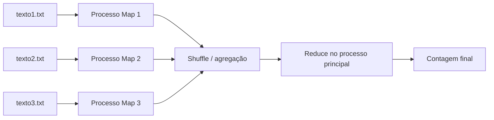

# Relatório — Processamento Distribuído com MapReduce

## 1. Introdução

Processamento distribuído consiste em dividir um problema entre unidades de
execução independentes que coordenam resultados por troca de mensagens. O modelo
MapReduce estrutura essa divisão em Map, que processa partições e produz pares
chave–valor; Shuffle/agregação, que reúne valores da mesma chave; e Reduce, que
combina os resultados parciais.

Neste experimento, cada ficheiro representa uma partição. Um processo Map conta
as palavras de uma partição, enquanto o processo principal recebe os dicionários
intermédios e executa a redução centralizada.

## 2. Arquitetura do teste

O cenário sequencial executa os mesmos três Maps, um após outro, antes do Reduce.
O cenário distribuído usa `multiprocessing.Pool`, com no máximo um processo por
ficheiro. Os ficheiros são percorridos linha a linha para limitar a memória usada.

## 3. Metodologia

1. Gerar três ficheiros determinísticos com `python gerar_dados.py`.
2. Executar `python lab_distribuido.py --repeticoes 3 --json resultado.json`.
3. Registar a mediana dos tempos, reduzindo a influência de ruído pontual.
4. Confirmar a igualdade das contagens produzidas pelos dois modos.
5. Calcular o speedup pela fórmula `S = T_sequencial / T_distribuído`.

Registar também processador, memória, sistema operativo, versão do Python,
tamanho dos ficheiros e número de processos, pois afetam a reprodutibilidade.

## 4. Resultados obtidos

O teste foi realizado em 4 de setembro de 2026, com Python 3.12.5 no Windows
11 (build 22631), processador Intel64 Family 6 Model 186 e 12 processadores
lógicos. Cada ficheiro tinha aproximadamente 8 MiB (24 MiB no total).

| Ficheiros | Processos | Repetições | Tempo sequencial (s) | Tempo distribuído (s) | Speedup |
|---:|---:|---:|---:|---:|---:|
| 3 | 3 | 3 | 3,6880 | 1,7714 | 2,08x |

As contagens sequencial e distribuída foram **iguais** nas três repetições. O
total observado foi de **3 253 791** palavras e **70** palavras distintas.

## 5. Discussão

A criação dos processos, a serialização dos argumentos e resultados e a
sincronização do `Pool` introduzem overhead. Por isso, entradas pequenas podem
ser mais rápidas no modo sequencial. Com entradas maiores, o custo fixo tende a
representar uma fração menor do tempo total.

O ganho normalmente não é linear. Além do overhead, a leitura concorrente pode
disputar a largura de banda do armazenamento, a fase Reduce permanece
centralizada e a duração total é limitada pela partição Map mais lenta. O número
de núcleos físicos e outros processos ativos também limitam o paralelismo real.

## 6. Conclusão

O experimento demonstra como a decomposição por dados permite escalar
horizontalmente tarefas independentes. MapReduce simplifica a coordenação e
preserva a correção mediante agregação determinística, mas o benefício depende
do volume de trabalho ser suficiente para compensar comunicação, criação de
processos e partes sequenciais do algoritmo.
